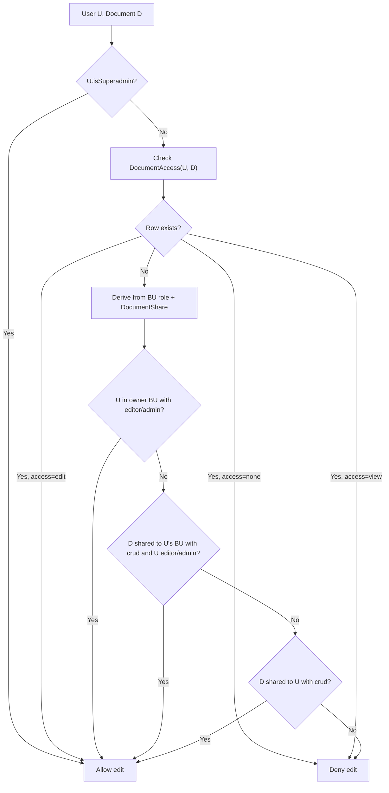

# 02 — Roles and Permissions

This document defines the five roles (Viewer, Editor, Admin, Superadmin, Author), what each can do per BU and per document, and how to decide “can user U perform action Y on document D?”.

---

## Role summary

| Role | Scope | View | Edit | Delete | Publish | Create |
|------|--------|-----|------|--------|---------|--------|
| Viewer | Per BU | Yes (if access) | No | No | No | No |
| Editor | Per BU | Yes (if access) | Yes (if access) | No | No | Yes (if author or editor in BU) |
| Admin | Per BU | Yes | Yes | Yes | Yes | Yes |
| Superadmin | All BUs | Yes | Yes | Yes | Yes | Yes |
| Author | Cross-BU | Depends on share/access | Depends on share/access | No* | No* | Yes (for specific or shared BUs) |

\* Author creates documents; subsequent edit/delete/publish are governed by Editor/Admin role and document access, not by Author alone.

---

## Definitions

### Viewer

- **Scope:** One or more BUs via UserBuRole(role=viewer).
- **Can view** a document if:
  1. Document is owned by a BU where the user is viewer **and** (no DocumentAccess or DocumentAccess.access ≠ `none`), or
  2. Document is shared to one of the user’s BUs with `consume` or `crud` **and** (no DocumentAccess or DocumentAccess.access ≠ `none`), or
  3. Document is shared to the user (targetType=user) with `consume` or `crud`.
- **Cannot:** edit, delete, publish, or create.

### Editor

- **Scope:** One or more BUs via UserBuRole(role=editor).
- **Can view** same as Viewer (for documents they have view access to).
- **Can edit** a document if:
  1. User has view access **and**
  2. Either:
     - Document is owned by a BU where the user is editor **and** (no DocumentAccess or DocumentAccess.access ∈ { view, edit }), or
     - Document is shared to one of the user’s BUs with `crud` **and** user is editor in that BU **and** (no DocumentAccess or DocumentAccess.access ∈ { view, edit }), or
     - Document is shared to the user (targetType=user) with `crud`, or
     - DocumentAccess.access = `edit` for this user.
- **Cannot:** delete or publish (those are Admin); can create if they have create permission in the BU or are Author.

### Admin

- **Scope:** One or more BUs via UserBuRole(role=admin).
- **Can view, edit, delete, publish** any document that:
  - Is owned by a BU where the user is admin, or
  - Is shared to a BU where the user is admin with `crud`.
- **Can create** documents for BUs where they are admin (or for shared scope if that’s allowed by policy).
- DocumentAccess with `none` can override: if explicit deny is desired for an admin, DocumentAccess(userId, documentId, none) would apply (implementation choice: allow or disallow explicit deny for admins).

### Superadmin

- **Scope:** Global (all BUs). No BU filter.
- **Can:** view, edit, delete, publish, create for **all** documents regardless of owner BU or share. Typically represented by a flag on User (e.g. isSuperadmin) and checked first before any BU/role logic.

### Author

- **Scope:** Cross-BU. Can create documents for a “specific BU” or for “shared” (multiple BUs).
- **Can create** documents; at creation time they choose owner BU and optional DocumentShare (which BUs/users get consume or crud).
- **After creation:** view/edit/delete/publish for those documents follow normal rules (Editor/Admin in the relevant BUs, or document-level share/access). So an Author might only have view or edit on a doc they created if they also have Editor/Admin in the owning or shared BU, or if the doc is shared to them with crud.

---

## Permission matrix (by document ownership and share)

| User role in BU | Doc owner | Doc shared to BU | DocumentAccess (user) | Can view? | Can edit? |
|-----------------|-----------|-------------------|------------------------|-----------|-----------|
| Viewer | Same BU | — | — or view | Yes | No |
| Viewer | Same BU | — | none | No | No |
| Viewer | Other BU | consume/crud to user’s BU | — or view | Yes | No |
| Editor | Same BU | — | — or view or edit | Yes | Yes (if not none) |
| Editor | Same BU | — | none | No | No |
| Editor | Other BU | crud to user’s BU | — or edit | Yes | Yes |
| Editor | Other BU | crud to user’s BU | none | No | No |
| Editor | Other BU | consume only | — | Yes | No |
| Admin | Same BU | — | — | Yes | Yes |
| Admin | Other BU | crud to user’s BU | — | Yes | Yes |
| Any | Any | shared to user (targetType=user) with crud | — | Yes | Yes |
| Any | Any | shared to user with consume | — | Yes | No |
| Superadmin | Any | Any | — | Yes | Yes |

---

## Decision flow: “Can user U edit document D?”

---

## Decision flow: “Can user U view document D?”

1. If U is **Superadmin** → allow.
2. If **DocumentAccess(U, D)** exists and access = `none` → deny.
3. Otherwise, allow view if any of:
   - D is owned by a BU where U has Viewer/Editor/Admin **and** (no DocumentAccess or access ≠ none), or
   - D is shared to a BU of U with consume or crud **and** (no DocumentAccess or access ≠ none), or
   - D is shared to U (targetType=user) with consume or crud.

---

## Draft vs published

- **Viewers / Editors** (without edit on the doc): see only **published** documents.
- **Editors with edit** / **Admins** / **Superadmin**: can see **draft** documents they are allowed to edit, and can publish (Admin/Superadmin) or submit for publish depending on policy.
- **Author**: sees draft of docs they created only if they also have view/edit via BU role or DocumentShare/DocumentAccess.

---

## Next

- [03-api-design-and-edge-cases.md](03-api-design-and-edge-cases.md) — List, get-one, and search APIs; request/response shapes; edge cases.
